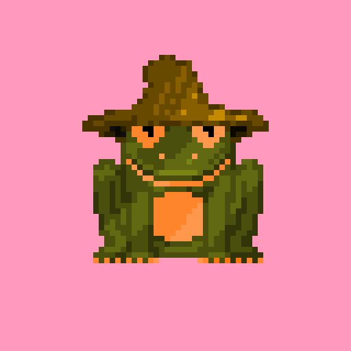

<title>freshfrogs.io/wiki 🍀</title>

### What is Fresh Frogs NFT?

---

<desc id="description">

    Fresh Frogs NFT is a collection of 4,040 randomly generated frogs that are each unique with thousands of different color combinations, traits, accessories, and more!

    Unbelievably, over 200,000 acres of rainforest are burned every day. That is over 150 acres lost every minute of every day, and 78 million acres are lost every year! A portion of every re-sale will be donated to The Rainforest Foundation, where every 1.00 ETH in donations will save 2.5 acres of natural rainforest forever!

</desc>

    

        <h4><a style="float: left;">Mint</a> <a style="float: center;">Morph</a> <a style="float: right;">Index</a></h4>
        

            

            

                <i id="label_name" class="label_name">Frog 3410 / 4040</i><i id="label_price" class="label_price">Quantity</i>
                <b id="frog_name" class="frog_name">0.01 ΞETH</b><b id="frog_price" class="frog_price"><b id="remove-frog">-</b> <b id="quant-frog">1</b> <a id="add-frog"><b>+</b></a></b>
            

        

        

            <button id="mint-button" class="button" onclick="connect()"><b><i>Connect Wallet !</i></b></button>
            

                > connect wallet...
            

        

    

### How do I Mint?

---

1. First **Connect** an Ethereum wallet! Don't have a wallet? We recommend **[Meta Mask](https://metamask.io/download/)** 🦊

    - Browser extensions will automatically be detected, a request will be sent to your provider.
    
    - When using a mobile device: Use the built in browser within your wallet app.

2. Next, **Select** up to NINE Frogs to mint per transaction!

    - You may mint up to NINE Frogs per transaction with a max of 40 Frogs per wallet!

3. Then, Click on **Mint** (transact) to submit the transaction!

4. Finally, Review and **Confirm** the transaction!

    - Review and confirm the request with your provider to send the transaction!

    - Make sure all details are correct, and the gas limit is appropriate!

- _What are Gas Fees?_

    - A "Gas Fee" is required when minting any NFT on to the Ethereum blockchain. **[Learn more](https://www.investopedia.com/terms/g/gas-ethereum.asp)**

### How do I View My Frogs?

---

- View your Frogs on **[OpenSea](https://opensea.io/account)** or at **[freshfrogs.io/the-pad](https://freshfrogs.io/the-pad)**

    - Frogs not displaying? Try manually checking: **[Scan Frog Txs]()**

    <h4 id="owned-frogs-header" style="margin-top: auto; margin-bottom: auto; margin-left: auto; margin-right: auto; cursor: pointer;"  onclick="connect()">Connect Wallet</h4>

### What is "Morphing" and How do I Morph?

---

- Frog holders will be able to "Morph" two Frogs to create a new NFT on Ethereum with combined attributes! Morphing will require a special token aquired through staking!

- Everyone can preview their morphs now at **[freshfrogs.io/the-pad](https://freshfrogs.io/the-pad)**

### What is Staking?

---

- NFT staking refers to locking up non-fungible tokens on a platform or protocol in exchange for staking rewards and other benefits! Staking NFTs allows holders to earn an income from their collection while maintaining ownership!

- Owner's can stake their Frogs to earn special tokens, rewards, participate in raffles, and more!