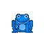
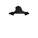
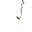
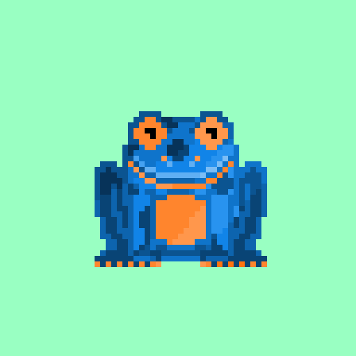

<title>freshfrogs.io/wiki 🍀</title>

    

### What is Fresh Frogs NFT?

---

<desc id="description">

    Fresh Frogs NFT is a collection of 4,040 randomly generated frogs that are each unique with thousands of different color combinations, traits, accessories, and more!

    Unbelievably, over 200,000 acres of rainforest are burned every day. That is over 150 acres lost every minute of every day, and 78 million acres are lost every year! A portion of every re-sale will be donated to The Rainforest Foundation, where every 1.00 ETH in donations will save 2.5 acres of natural rainforest forever!

    <i id="created_date"></i>

</desc>

    

        
<button id="buttonbar_mint" class="button_1 buttonbar_mint_on" onclick="load_mintingTerminal()"><b>🐸Mint</b></button><button id="buttonbar_morph" class="button_1" onclick="load_morph()"><b>🍄Morph</b></button><button id="buttonbar_stake" class="button_1"><b>📌Stake</b></button>

        

            

                <i id="label_name" class="label_name">4040 Total Supply</i><i id="label_price" class="label_price">Quantity</i>
                <b id="frog_name" class="frog_name">0.01 ΞETH</b><b id="frog_price" class="frog_price"><a id="remove-frog" onclick="remove_frog();"><b>-</b></a> <b id="quant-frog">1</b> <a id="add-frog" onclick="add_frog()"><b>+</b></a></b>
            

            

                

                

                

                    

                

            

        

        

            <button id="mint-button" class="button" onclick="refreshPage()"><b><i>Connect Wallet !</i></b></button>
            

                > connect wallet...
            

        

    

### How do I Mint?

---

 

1. First **Connect** an Ethereum wallet! Don't have a wallet? We recommend **[Meta Mask](https://metamask.io/download/)** 🦊

    - Browser extensions will automatically be detected, a request will be sent to your provider.
    
    - When using a mobile device: Use the built in browser within your wallet app.

2. Next, **Select** up to NINE Frogs to mint!

    - You may mint up to NINE Frogs per transaction with a max of 40 Frogs per wallet!

3. Then, Click on **Mint** (transact) to submit the transaction!

4. Finally, Review and **Confirm** the transaction!

    - Review and confirm the request with your provider to send the transaction!

    - Make sure all details are correct, and the gas limit is appropriate!

- __What are Gas Fees?__

    - A "Gas Fee" is required when minting any NFT on to the Ethereum blockchain. **[Learn more](https://www.investopedia.com/terms/g/gas-ethereum.asp)**

- __Verified Smart Contract on Ethereum__

    - Our smart contract has been verified on **[etherscan.io](https://etherscan.io/address/0xbe4bef8735107db540de269ff82c7de9ef68c51b)** ✔️

    - *contract address: 0xBE4Bef8735107db540De269FF82c7dE9ef68C51b*
    
 

### How do I View My Frogs?

---

- View your Frogs on **[OpenSea](https://opensea.io/account)** or at **[freshfrogs.io/the-pad](https://freshfrogs.io/the-pad)**

- Connect an Ethereum wallet to display your Frogs below!

    - Frogs not displaying? Try manually checking: <b style="cursor: pointer;" onclick="load_ownedFrogs_manual();">Scan Frog Txn</b>

    - Click on a Frog to view attribute rarities, Morph, and more!

    - *connected:* <i id="user-add">[ X ]</i>

---

    <button id="button_ownedfrogs" class="button_2" style="margin-top: auto; margin-bottom: auto; margin-left: auto; margin-right: auto; cursor: pointer;" onclick="refreshPage()">Connect an Ethereum wallet to view Frog Tokens!</button>

### How do I Morph?

---

    
    
    
    
    

Preview Frog Morph Combinations!

1. **Connect** an Ethereum Wallet that holds Fresh Frog Tokens!

2. Go to the <button id="morph_ref" class="buttonbar_morph"><b>🍄Morph</b></button> tab and **Select** two Frogs to Morph!

    - First select the **Base Frog!** This Frog will keep all attributes, except for colored traits! 

    - Then select the **Sub Frog!** This frog will have all attributes inherited, without overwriting existing!

    - This means there are two possible morph combinations for every two Frogs!

        - **Example** FROG A + FROG B will have a different outcome than FROG B + FROG A

3. **Generate Morph!**

    - A NEW Frog will be generated with combined attributes!

    - <u>This is currently just a preview until the full utility is released!</u>

### What is Morphing?

---

Holders will be soon able to "Morph" two Frogs to create a new NFT on Ethereum with combined traits! Morphing will require a special token aquired through staking!

- What will happen to My Frogs after I Morph?

    - Existing Frogs will remain without change, and a NEW NFT will be created on Ethereum!

- When will the full Morph utility be released?

    - Once the full collection of 4,040 Frogs has been minted!

- What will it cost to Morph?

    - Morphing will require a special token aquired through staking, and a gas fee will be needed to create the NEW NFT! These "special tokens" will be free and easy to obtain for Frog owners through [staking]()!

- What is Meta-Morphing?

    - (N)ew (F)rog (T)okens can be combined to create even more Frogs! More details coming soon!

### What is Staking?

---

NFT staking refers to locking up non-fungible tokens on a platform or protocol in exchange for staking rewards and other benefits! Staking NFTs allows holders to earn an income from their collection while maintaining ownership!

- Frog Owners will have the option to stake in return for special tokens! That can be used to redeem free mints, morph, enter raffles and more rewards!

- Passive Income from Fresh Frog Staking -- Passive income streams, via royalty payouts and token rewards!

    - Fresh Frog Owners will be able to stake to earn **passive income** by **a.)** earning tokens that can be used for utilities and **b.)** loyalty reward payments from sales royalties!

### Fresh Frogs META

---

    

All 4,040 Frogs are randomly generated and each unique! There are 30 different Frog Types, with 60 different traits! Resulting in 2.8 million possible combinations!

- There are EIGHT **Base Frog Type** variantions within the collection. They are the most common!

    - These common Frog types are green with different patterns.

- There are NINE **Colored Frog Type** variantions within the collection. They are rare!

    - These colorful Frog types are harder to come by, the rarest being the Golden Tree Frog!

- There are FIVE **Special Frog Types** within the collection! They are the very rare!

    - The rarest being the "peace" frog; a blue Frog holding the victory sign, less than 0.25% of the collection have this attribute!

- There are EIGHT Frog types that *can* hold an extremely rare **"Natural" Trait.** These are the most rare!

    - A 1/30th chance to recieve a Frog that can hold a "special" natural trait, and a 1/19th chance to recieve said trait!